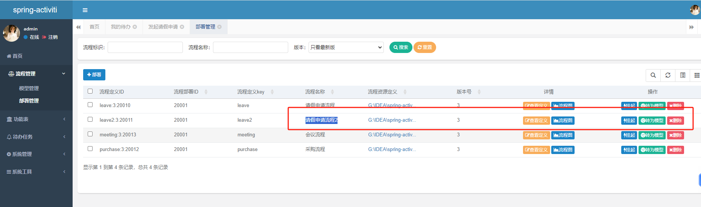
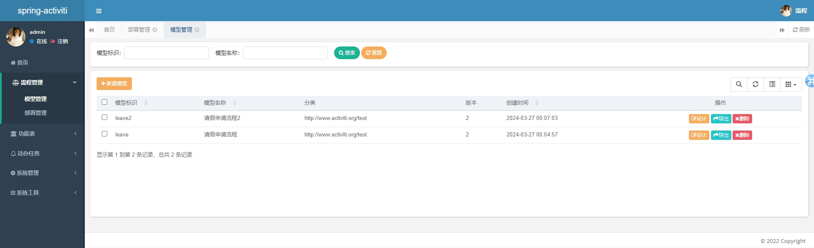
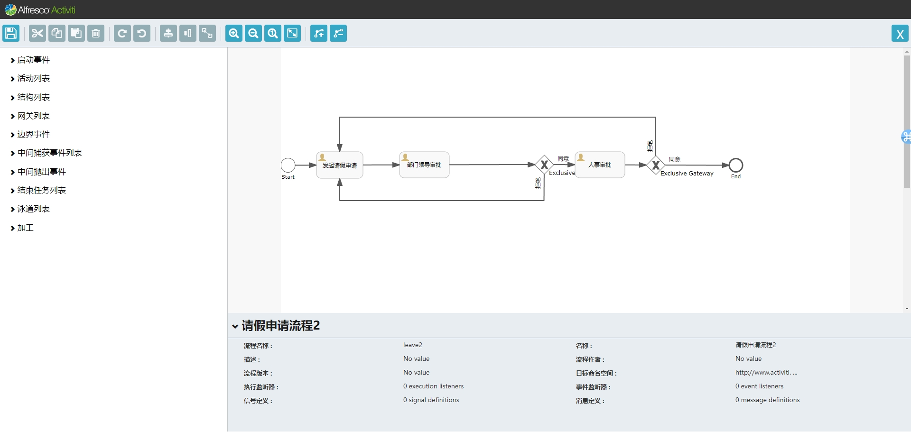
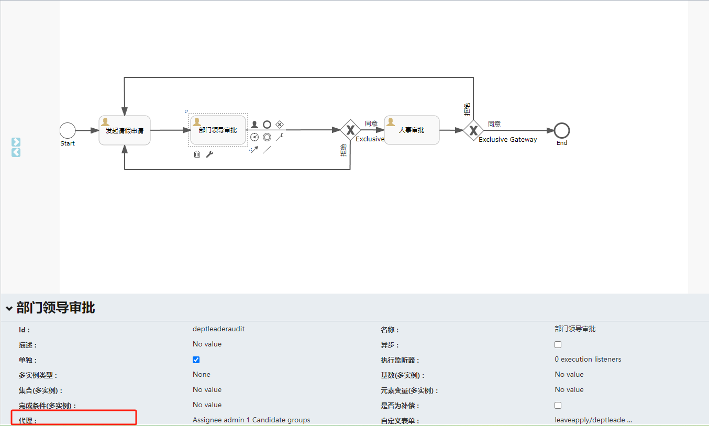
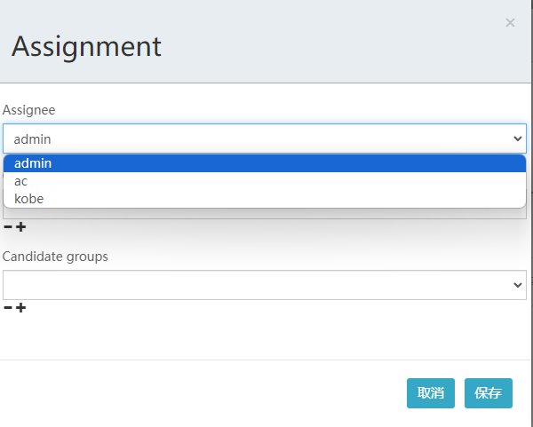
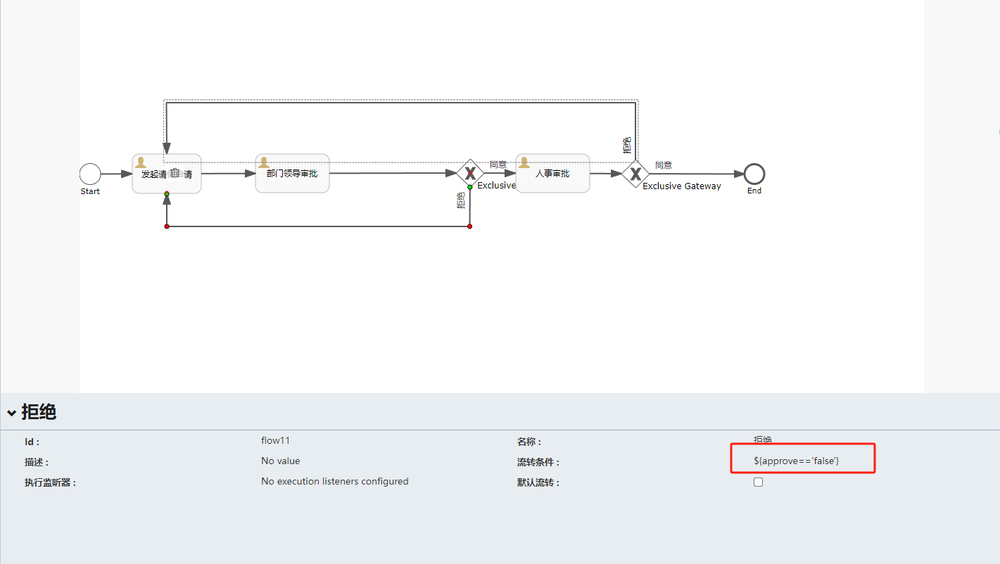
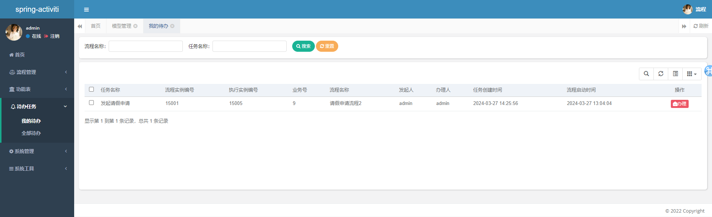

# Spring-activiti

#### 软件架构
JDK1.8、SpringBoot2、MyBatis-plus、Activiti6、Activiti原生编辑器、SqlServer

#### 安装教程

1. 新建sqlserver数据库spring-activiti，导入SQL脚本spring-activiti.sql，创建需要的表，activiti相关的表会在项目启动后自动创建
2. 修改application-sqlserver.yml配置文件中数据库url和账密 
3. 打开http://localhost 访问登录页面，目前有三个账号，其中admin是管理员：

| 账号    | 密码       |
|-------|----------|
| admin | admin123 |
| kobe  | 111111   |
| ac    | 111111   |

没实现注册功能，要添加用户可以使用添加用户或直接往sys_user添加数据实现，密码计算见SysPasswordService.main方法

#### 使用说明

1. 暂时只实现了申请单的完整审批流程，首先在“部署管理”页将“请假申请流程2”转为模型
   
2. 流程管理-模型管理对审批流模型进行管理，支持新增模型
   
3. 点击设计对审批流程进行编辑
   
4. 点击代理选择审批人
   
   支持选择审批人或审批人组
   
5. 排他网关需要设置分支流参数
   
- 同意：${approve=='true'}
- 拒绝：${approve=='false'}

6. 支持查看我的待办和全部待办任务
   
7. 点击办理即可对流程进行审批办理，支持驳回和通过，查看审批流详情
